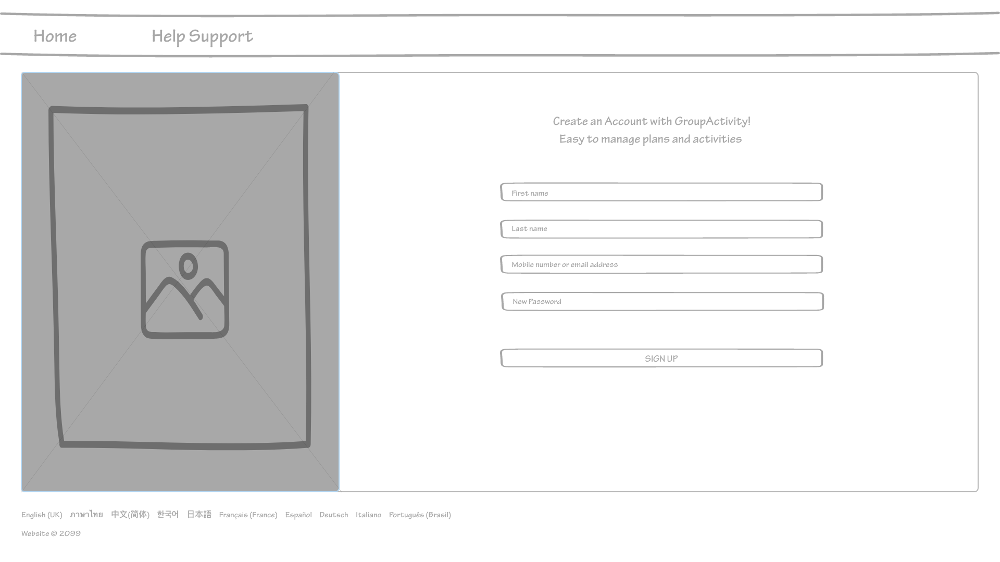
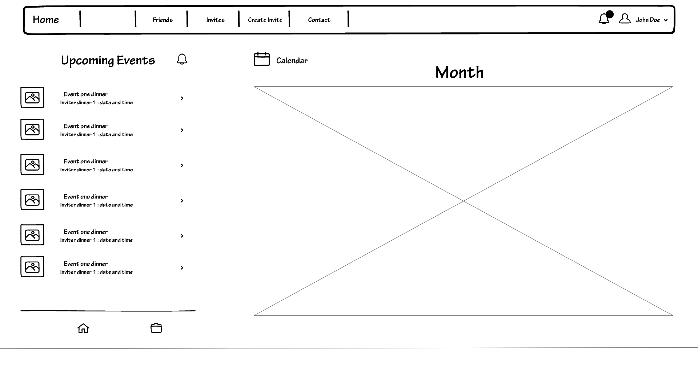
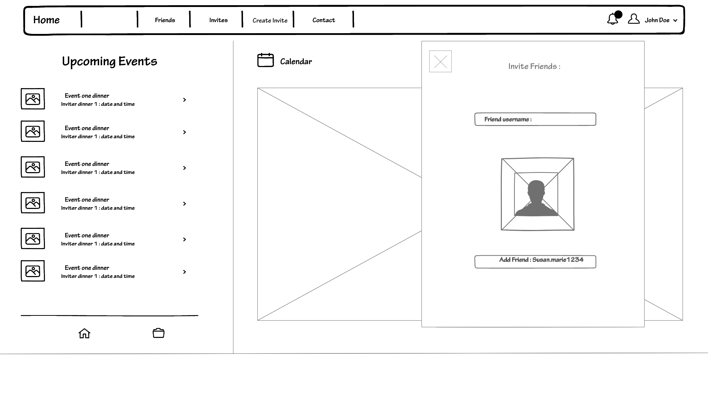

This is the Login page where the prototype starts

From the login page we transition to the sign up page where users put personal account information and sign up.

If an error occurs while making an account or loging in there is support contact information

Once signed in transitions to the main home page of the wireframe, where you do everything on the prototype

Clicking on one of the invites from the homepage will open a popup to view

This is where you see new invites not currently in the upcoming events section. You can accept or decline them

This is how you create invites from the home menu, set up time date and any necessary info you need for an event and then share with friends

Sort events between public and private events clicking on the bell

Clicking on the friends tab will open this popup to allow users to send friend requests
